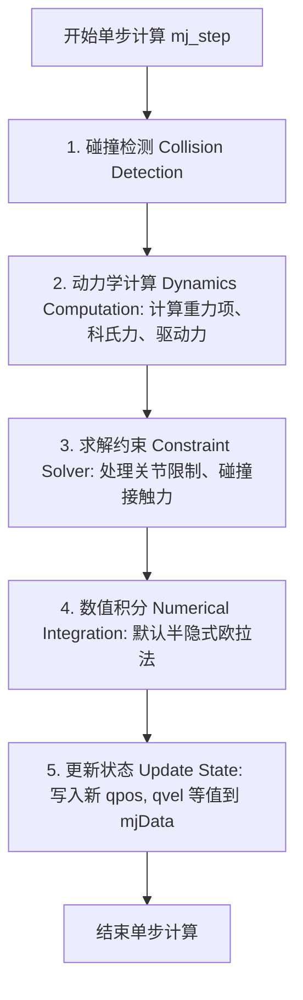

# 第三章：Python API 基础与状态获取

在本章中，我们将深入了解 MuJoCo 的 Python 仿真控制循环，学习如何提取物体的物理状态（位置、速度、加速度等），并对多自由度/自由关节的独特数学表达形式进行剖析。最后，我们将通过代码实战绘制小球自由落体的数据图表。

---

## 1. 学习目标
* **理解仿真前向步进机制**：掌握 `mujoco.mj_step(model, data)` 的执行流程与物理计算本质。
* **掌握 `mjData` 状态量**：熟练区分并提取 `qpos`（广义位置）、`qvel`（广义速度）、`qacc`（广义加速度）与 `xpos`（笛卡尔绝对位置）。
* **掌握自由关节的数学表示**：理解为什么自由关节（Free Joint）的广义位置维度为 7，而广义速度维度为 6，并掌握四元数（Quaternion）的表达形式。
* **数据可视化与分析**：学会实时记录仿真数据，并利用 `matplotlib` 绘制物体的物理量变化曲线。

---

## 2. 核心物理原理

### 2.1 MuJoCo 的前向步进循环
在 MuJoCo 中，仿真是一个连续的物理时间步迭代过程。核心语句是：
```python
mujoco.mj_step(model, data)
```
该函数在底层执行了复杂的多体动力学计算，其工作流程可以简化为以下几个关键步骤：



* **数值积分时间步长（`timestep`）**：在 `<option>` 中配置，例如 `0.002` 秒（即 2 毫秒）。这意味着物理引擎每步仅推进 2ms 的时间。如果时间步长设置过大，仿真容易失稳“爆炸”；设置过小，会极大地消耗 CPU 计算资源。

---

### 2.2 `mjData` 中状态变量的区别与联系

在第一章中，我们得知 `mjModel` 存放静态模型参数，而 `mjData` 存放动态仿真状态。以下是 `mjData` 中最核心的四个状态数组：

| 变量名 | 物理意义 | 维度（Size） | 坐标系与说明 |
| :--- | :--- | :--- | :--- |
| **`data.qpos`** | **广义位置 (Generalized Position)** | `model.nq` | **关节坐标系**。描述关节的相对状态（如旋转角度、滑动距离等）。 |
| **`data.qvel`** | **广义速度 (Generalized Velocity)** | `model.nv` | **关节速度空间**。描述关节的一阶导数（角速度、线速度等）。 |
| **`data.qacc`** | **广义加速度 (Generalized Acceleration)** | `model.nv` | **关节加速度空间**。描述关节的二阶导数。 |
| **`data.xpos`** | **笛卡尔位置 (Cartesian Position)** | `(nbody, 3)` | **全局/世界坐标系**。物体三维空间质心的绝对坐标 $[X, Y, Z]$。 |

#### 💡 广义位置 `qpos` 与 笛卡尔位置 `xpos` 的关键区别：
* `qpos` 基于**相对/关节坐标系**。例如：对于一个双摆，它的关节坐标系中只有两个关节角度 $[\theta_1, \theta_2]$，只要这两个值确定了，双摆的状态就确定了。
* `xpos` 基于**绝对/笛卡尔坐标系**。它是指每个摆杆在 3D 世界空间里的具体三维坐标（如 $[x_1, y_1, z_1]$）。
* **联系**：在每次 `mj_step` 后，MuJoCo 会根据当前的 `qpos` 自动执行**正向运动学（Forward Kinematics）**计算，算出各个刚体在世界系下的绝对三维位置并存入 `xpos`。

---

### 2.3 自由关节（Free Joint）的特殊性

当我们给一个物体（如小球）声明了自由关节 `<joint type="free"/>` 时，它可以在三维空间中自由移动和旋转。

#### 1. 为什么 `nq = 7` 而 `nv = 6`？
* **自由度 (Degree of Freedom) = 6**：一个自由物体在空间中拥有 6 个自由度（3个平移自由度，3个旋转自由度）。因此，它的速度和加速度只需要 6 个独立的量即可完全描述，即：
  $$\text{qvel} = [v_x, v_y, v_z, \omega_x, \omega_y, \omega_z]$$
* **状态位置表示（`nq = 7`）**：在表示旋转姿态时，如果我们使用 3 个欧拉角（如 Roll-Pitch-Yaw），会遇到著名的**“万向锁（Gimbal Lock）”**数学奇异性问题。为了避免这一问题，MuJoCo 采用**四元数（Quaternion）**来表示三维旋转。
  * 四元数由一个 4 维单位向量表示：$q = [q_w, q_x, q_y, q_z]$，满足 $q_w^2 + q_x^2 + q_y^2 + q_z^2 = 1$。
  * 因此，自由物体的广义位置由 $3 \text{（平移）} + 4 \text{（四元数旋转）} = 7$ 维向量表示：
    $$\text{qpos} = [x, y, z, q_w, q_x, q_y, q_z]$$

> [!WARNING]
> **切记**：在编写涉及自由关节的代码时，索引必须十分小心：
> * `data.qpos[0:3]` 代表位置 $[x, y, z]$。
> * `data.qpos[3:7]` 代表四元数 $[q_w, q_x, q_y, q_z]$。
> * `data.qvel[0:3]` 代表线速度 $[v_x, v_y, v_z]$。
> * `data.qvel[3:6]` 代表角速度 $[\omega_x, \omega_y, \omega_z]$。

---

## 3. 代码实战与运行说明

本章的配套实战代码在 [ch3_free_drop.py](file:///d:/code/learning/mujoco-py/ch3_free_drop.py) 中。

### 3.1 核心代码逻辑展示
在仿真循环中，我们通过记录每一步的数据：
```python
# 记录时间、Z轴位置（qpos[2]）、Z轴速度（qvel[2]）和Z轴加速度（qacc[2]）
time_log.append(data.time)
z_pos_log.append(data.qpos[2])
z_vel_log.append(data.qvel[2])
z_acc_log.append(data.qacc[2])

# 推进仿真
mujoco.mj_step(model, data)
```

### 3.2 曲线图分析
运行程序后，会生成如下的状态变化曲线（并自动保存为 `ch3_free_drop_plot.png`）：
1. **高度曲线**：呈现经典的二次抛物线规律加速下落。在碰到地板（z=0.2m，即小球半径处）时发生剧烈碰撞反弹。
2. **速度曲线**：下落时速度沿负方向线性增加（斜率为 $-g = -9.81$），碰撞瞬间速度剧烈反向，之后在反弹上升过程中速度逐渐减小。
3. **加速度曲线**：在空中下落时加速度稳定在 $-9.81 \text{ m/s}^2$。在与地面碰撞的一瞬间，由于接触力（Contact Force）的作用，会产生一个巨大的正向脉冲加速度。

---

## 4. 课后练习

为了巩固本章的知识，请完成以下练习：

### 练习 1：平抛运动仿真
修改 [ch3_free_drop.py](file:///d:/code/learning/mujoco-py/ch3_free_drop.py) 代码，在仿真开始前（`with` 语句之前），给小球赋予一个沿 X 轴正方向的初始速度 $2.0 \text{ m/s}$：
```python
# 提示：找到 qvel 中代表 X 轴线速度的索引
data.qvel[0] = 2.0
```
运行仿真，并修改绘图部分，绘制出小球在 X-Z 平面上的运动轨迹（散点图或折线图），验证其是否符合高中物理的平抛运动轨迹。

### 练习 2：深入思考
1. 为什么小球下落到最后会静止在地板上？在这个过程中，什么物理机制消耗了小球的机械能？（提示：可以查阅 `<geom>` 标签中的 `solref` 和 `solimp` 参数，或者考虑碰撞时能量损耗的默认设置）。
2. 在平抛/自由落体过程中，如果我们将空气阻力考虑进来（在 MuJoCo 中可以通过在 `<option>` 中设置 `wind` 或 `density` 参数），高度曲线和加速度曲线会发生什么变化？
